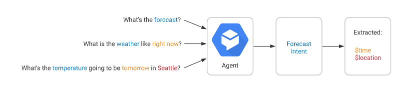

# ChatBot

Google의 Dialogflow Platform을 활용한 실습 프로젝트 

- Dialogflow의 가장 큰 특징은 기존의 챗봇 플랫폼과는 다르게 가급적 코딩을 사용하는 방식을 지양하고, Dialog(대화)의 Flow(흐름)를 만들기만 하면 챗봇을 만들수 있는 용이성이 있다.
- 대화를 구성하는 기본 개념인 화자의 `Intent` , `Entity` , `Context` 를 이해하는 것이 중요하며 이를 잘 지원하도록 설계 되어 있다.
	- `Intent Matching` : Dialogflow의 다양한 intent 중에서 사용자가 말한 intent를 파악하여 , Dialogflow가 수행해야 할 작업 간의 매핑을 나타내는 것.

---

## Getting Started 

### GCP에서 Dialogflow 시작하기

- Dialogflow에는 Standard와 Enterprise 2가지 Edition이 있다. 본 테스트에서는 Standard Edition을 사용한다. (https://console.dialogflow.com/api-client/#/login)
- Enterprise Edition은 기업 환경에 적합한 성능과 기능을 제공하는 Edition으로, 텍스트 뿐만 아니라 음성도 지원 가능하며 기업 환경에 적합하게 99.9%의 SLA를 보장한다. GCP 관리 콘솔을 통해서 생성해야 한다. API&Services를 선택하고 Dialogflow를 검색하여 Dialogflow API를 enable하면 된다. (물론 비용이 든다.)

#### [Step 1] 신규 Agent 생성 및 예제 파일 가져오기

- `my-dialogflow-agent`로 신규 Agent를 생성한다.
- agent 설정에서 `Export and Import`를 선택 후, `Restore From Zip`을 선택하여 data 폴더에 있는 `my-dialogflow-agent.zip` 파일을 업로드 한다.

- 2개의 인텐트가 생성되며, Default Fallback Intent를 클릭하여 What is your name?을 입력하여 기본 응답을 확인한다.
	- Default Welcome Intent : 최종 사용자가 에이전트와 대화를 시작할 때 일치된다. 대화를 시작하기 위해 최종 사용자에게 에이전트가 무엇을 하는지 또는 대화를 시작하기 위해 무엇을 말할 수 있는지를 알려주는 응답을 반환해야 한다.
	- Default Fallback Intent : 에이전트가 최종 사용자 표현을 다른 인텐트와 일치시킬 수 없을 때 일치한다.

#### [Step 2] 신규 인텐트(Intent) 생성하기

- 'what is your name?'이라는 질문에 답변할 수 있는 인텐트를 만들어 본다. 인텐트마다 최종 사용자 표현이라고 하는 다수의 학습 문구를 정의한다.
- `get-agent-name`으로 신규 인텐트명을 입력하고, 학습문구를 추가한다. 그리고 응답 섹션의 텍스트 응답 섹션에 문구를 입력한다.
- 시뮬레이터에서 What's your name?을 입력하면 새로운 응답을 확인할 수 있다.

#### [Step 3] 매개변수(Parameter) 만들기

- Runtime시 인텐트가 일치할 때, Dialogflow는 최종 사용자 표현에서 추출된 값을 매개변수로 제공한다.
- 각 매개변수에는 데이터가 정확히 어떻게 추출되는지를 나타내는 항목 유형이라는 유형이 있는데, 원시 최종 사용자 입력과 달리 매개변수는 일부 로직을 수행하거나 응답을 생성할 때 손쉽게 사용할 수 있는 구조화된 데이터이다.
- Agent를 build할 때 학습 문구의 일부를 주석 처리하고 관련 매개변수를 구성하여 데이터 추출 방식을 제어할 수 있다.

#### [Step 4] 고유한 항목(Entity) 만들기

- 대부분의 경우 시스템 항목에서 제공하지 않는, 사용자에게서 수집해야 하는 특정 데이터가 있는데 Custom 항목을 만들어 이러한 데이터를 처리할 수 있다.
- 복수 및 대소문자와 같은 간단한 부분은 Dialogflow에서 처리할 수 있지만, 항목에 가능한 모든 동의어는 개발자가 추가해야 한다.
- 동의어를 많이 추가할수록 에이전트가 항목을 더 잘 결정할 수 있다.

- Custome 매개변수를 추가하고, 시뮬레이터에서 `I know how to code in py`를 입력하여 테스트를 수행한다.

